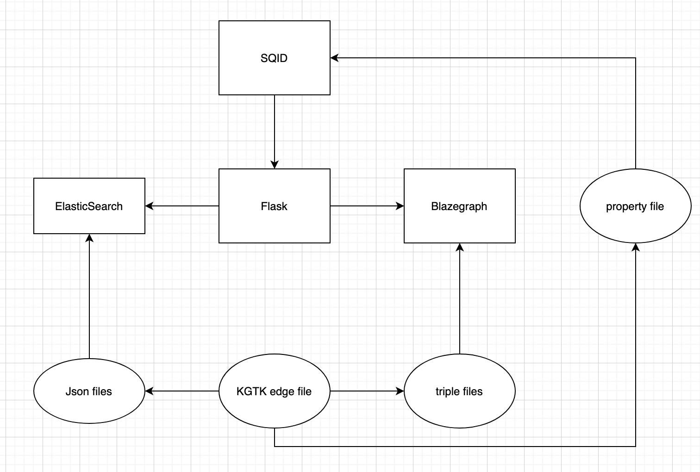

# SQID (KGTK)

Slim and customizable sqid interface.

[Introduction](#introduction)
[Architecture](#architecture)
[Configurations](#configurations)
[Example](#example)
[Development Path](#development-path)

## Introduction

ISI SQID is an adoptation of the Wikidata [SQID](https://github.com/Wikidata/SQID) project. It is a browser of knowledge graph which was designed to be used with Wikidata only. Thanks to [KGTK](https://kgtk.readthedocs.io/en/latest), at ISI we can use SQID to explore any knowledge graph.

Below is a nice screenshot of a Macroscore Paper entity.


### Differences between this version and Wikidata's SQID

#### Data
With the development of KGTK, you can use any data as long as it can be convereted into a KGTK file. The conversion of KGTK file to the data formats that Wikidata accepts are automatically done by KGTK commands. Specifically `kgtk generate-wikidata-triples` and `kgtk generate-mediawiki-jsons`.

#### Queries
Original SQID depends on two endpoints of Wikidata to function.
1. The sparql [endpoint](https://query.wikidata.org/). Most of the time we use its WDQS interface to interact with it. The backend is essentially a [Blazegraph](https://github.com/wikimedia/wikidata-query-blazegraph) database.
2. The Mediawiki APIs, specifically the [wbgetentities](https://www.wikidata.org/w/api.php?action=wbgetentities&ids=Q42) API.

#### Notes on original design choice

It is not possible to load large amount of data into official Wikidata knowledge graph even the test instance. In order to have the Wikibase functionality, we originally tried [Wikibase](https://github.com/wmde/wikibase-docker). It comes with both the backend, the UI and the quickstatements. However, the speed of loading triples is very low, less than 200/sec which is unacceptable.

## Architecture

There are three major parts.

1. the SQID frontend.
2. The Blazegraph and WDQS. They are not included in this repo. To work on MacroScore project, simply reuse the instance already running on sitaware (will be illustrated in the example section). Also it is easy to set up a new instance following the document of wdqs backend and UI [here](https://github.com/wikimedia/wikidata-query-rdf) and [here](https://github.com/wikimedia/wikidata-query-gui).
3. Elasticsearch

The relationship between these components is illustrated as below. Squares mean modules and eclipses mean data.



For the data side, you need to prepare a kgtk edge file with four fields: `node1, label, node2 and id`, create the `.josnl` file and the `.ttl` file, populate the Elasticsearch and Blazegraph separately first, then put the property file in the `flask/flask_data` folder.

After that, this is what happens for a normal usage.

1. A user searches an entity in SQID.
2. SQID sends all queries to the Flask backend
3. Flask forwards Sparql queries to the sparql endpoint and json queries to Elasticsearch endpoint.
4. Data will be sent back to SQID to populate the page.

### SQID frontend

SQID is in this root repo.

The offline analysis is removed, several type checkings and restrictions are also removed. To restore some offline analysis, it is much easier to do with the `WDQS` interface using sparql query. The original sqid sets up analysis tasks using the Dump file, which is essentially a workaround of large Wikidata dataset. 

### Blazegraph and WDQS

Blzaegraph and WDQS (Wikidata Query Service) are not in this repo. They are standard triple store and UI for Wikidata.

Below is the official repo.

1. [RDF store](https://github.com/wikimedia/wikidata-query-rdf)
2. [WDQS frontend](https://github.com/wikimedia/wikidata-query-gui)

However, when the Macroscore system was setup, the gui module is part of the large `wdqs` repo so if you work on Macroscore, you will find the `gui` directory a subfolder of the `wikidata-query-rdf` folder.

If you are working on Macroscore, the interface is already setup on port [14000](http://sitaware.isi.edu:14000/), the Blzegraph is actually running on port `13999` locally, but you won't have access to it. All interactions go through `14000`. 

The key part for the port forwarding is done in nginx config file `/etc/nginx/conf.d/wikidata-macroscore-light.conf`. The content is below.

Note that if you want to update nginx, only create an individual nginx config file and don't mess up with other services. You need to switch to `root` and run the `~/nginx.sh` at the home directory of user `root`.

```
server {
    listen 14000;
    server_name sitaware.isi.edu;

    # gui
    location / {
	root /data01/wikidata/wikidata-query-rdf-0.3.2-macroscore-light/dist/target/service-0.3.2-SNAPSHOT/gui;
    }

    # restrict dashboard
    location /bigdata {
        return 404;
    }

    # restrict write access
    location /admin {
        auth_basic "Restricted";
        auth_basic_user_file /etc/nginx/.htpasswd;

        proxy_set_header X-BIGDATA-MAX-QUERY-MILLIS 1800000;
        client_max_body_size 500M;
        client_body_buffer_size 80M;
        proxy_intercept_errors on;
        proxy_buffering on;
        proxy_buffer_size 256k;
        proxy_buffers 512 32k;
        proxy_busy_buffers_size 512k;
        proxy_temp_file_write_size 512k;
        proxy_max_temp_file_size 0;
        proxy_read_timeout 600s;

        rewrite ^/admin/(.*)$ /$1 break;
        proxy_pass http://localhost:13999;
    }

    # public query endpoint
    location /bigdata/namespace {
        proxy_pass http://localhost:13999;

        proxy_set_header Host $http_host;
        proxy_set_header X-Real-IP $remote_addr;
        proxy_set_header X-Forwarded-For $proxy_add_x_forwarded_for;
        proxy_set_header X-Forwarded-Proto $scheme;
        proxy_set_header X-BIGDATA-MAX-QUERY-MILLIS 1800000;

        #add_header Access-Control-Allow-Origin *;

        client_max_body_size 500M;
        client_body_buffer_size 80M;
        proxy_intercept_errors on;
        proxy_buffering on;
        proxy_buffer_size 256k;
        proxy_buffers 512 32k;
        proxy_busy_buffers_size 512k;
        proxy_temp_file_write_size 512k;
        proxy_max_temp_file_size 0;
        proxy_read_timeout 600s;
    }
}
```

The key directory is `/data01/wikidata/wikidata-query-rdf-0.3.2-macroscore-light/dist/target/service-0.3.2-SNAPSHOT/gui`. To access it, you need to `sudo su wikidata`. Note that the wikidata (Blazegraph) work routine is mostly setup by Yixiang, so if you have doubt, please refer to him.

In the home directory of user `wikidata`, there is a folder `jnls`, it stands for journal files. It is where we store all the journal files for Blazegraph. Journal file is the single place where Blazegraph stores the data. It may not be safe to copy/delete the journal files when the Blazegraph instance using it is still running. The journal file for Macroscore is called `wikidata_macroscore_light.jnl`. It is about 100MB now.

Now, go to `/data01/wikidata/wikidata-query-rdf-0.3.2-macroscore-light/dist/target/service-0.3.2-SNAPSHOT`, this is where all the useful scripts/executables are stored. There are 6 files/folders you should know.

1. gui. This folder is the root folder defined in nginx config file.
2. loadRestAPI_MacroScore.sh. This is the script to load triple file into Blzegraph: `loadRestAPI_MacroScore.sh -d sample.ttl`.
3. RWStore.properties. This is the config file for Blazegraph. The most important parameter is the location of the `jnl` file. If the disk runs out of space, you can change the location of the journal file.
4. stop.sh. Run this script to securly stop **this** Blazegraph (the one running on 13999)
5. start.sh. Run this script to start this Blazegraph service. Note that the log is written to `/var/log/wdqs_macroscore/bg_light.log`.
6. runBlazegraph.sh. This is the script that actually invokes Blazegraph, note that the `domain` and `port` are defined in this file. If you change this file, be sure to change the nginx setting too.

A common workflow to reset/restart a Blzegraph service is following.

1. `./stop.sh` to stop the Blzegraph service.
2. Go to `~/jnls/` to backup or delete the `wikidata_macroscore_light.jnl` journal file. Make sure you **DO NOT** delete other journal files.
3. `./start.sh` to start the Blzegraph service. It usually takes 5-10 seconds.
4. Use `loadRestAPI_Macroscore.sh -d path_to_sample.ttl` file to load the triple files. Note that Blazegraph will try to rename the `sample.ttl` file to `sample.ttl.good` if the importing is successful. Otherwise, it will create a `sample.ttl.fail` in the same directory where the `sample.ttl` resides.
5. Verify the existence of entities just imported into the Blazegraph. You can use `describe wd:Qxxx` in the [WDQS](http://sitaware.isi.edu:14000/).

After setting up the Blazegraph, the sparql endpoint is accessible at `http://localhost:14000/bigdata/namespace/wdq/sparql`. Note that this also go through nginx proxy. This is handled in the Flask APP.

### ElasticSearch

The Elasticsearch part is responsible for handling the `wbgetentities` query. It is in the `flask/es/` folder. These module is rather a bunch of Python scripts to interact with the running Elasticsearch linux service. 

You can run the following Python script to test the validity of the Elasticservice.

```
from elasticsearch import Elasticsearch
from config import MAPPING_FILE, ELASTICSEARCH_HOST, INDEX
client = Elasticsearch(ELASTICSEARCH_HOST)
```
If something is wrong with the Elasticsearch service, change to root and check directory `/etc/init.d/`. Restart the Elasticsearch service.

There are three files in the the folder. 

1. config.py stores important configurations, specifically the index (the [database](https://www.elastic.co/blog/what-is-an-elasticsearch-index) name, the default is `macroscore`), the path to the folder where the data is stored and most importantly the mapping json.
2. create_index.py running this script **recreates** the index(database) as a fresh one which will **remove** all existing records stored under the index.
3. import_data.py will import all `.jsonl` files stored in the `DATA_FOLDER_PATH` variable. The loading is in bulk.

#### [Mapping](https://www.elastic.co/guide/en/elasticsearch/reference/current/mapping.html) json

The `MAPPING_FILE` is a crucial variable to tell Elasticsearch which fields of the imported data should be parsed properly and which can be ignored (only store them). 

For example, the `analyzer: english` of the `labels:en:value` indicates that the `value` will be parsed using the default english analyzer. Below is a json object in the `es_data/macroscore.jsonl` file. Note that many fields are just place-holders like `-`, `2000-01-01T00:00:00Z`, etc.

```
{"Q00_derived_score": {"labels": {"en": {"languange": "en", "value": "Derived score entity"}}, "descriptions": {}, "aliases": {}, "claims": {}, "sitelinks": {}, "type": "item", "id": "Q00_derived_score", "pageid": -1, "ns": -1, "title": "Q00_derived_score", "lastrevid": "2000-01-01T00:00:00Z"}}
```
Elasticsearch will try to process this data according to the mapping configuration, so `Derived score entity` will be parsed. When you search `derived` in SQID search box, this object (entity in terms of KG) will be a matching candidate.

The details of the query is handled by `_wiki_proxy()` function in `flask/app.py` and then further handled by `build_wbsearch_dicts_es()` function in `flask/utility.py`.

One significant drawback in current version is that it doesn't support delete. One improvement is to implement it so when you update an entity, 

1. Find whether an entity is already in the Elasticsearch index.
2. If the entity is already in Elasticsearch, pull it out, update its field with new data
3. write back to Elasticsearch

This will significantly increase the usability of the database but writing will be slower too. To do this, a stable data model is required. Please refer to the example about stable data model.

### The Flask app.

The Flask app only does two jobs.

1. dispatch the requests to either sparql endpoint or mediawiki json endpoint.
2. Reformatting the returns to the format that SQID accepts. If there is no data, fabricate a fake one.

By default, the `MAPPING_FILE` in `flask/es/config.py` only analyze the **labels** and **descriptions** fields. Therefore, when searching the Elasticsearch, we also only search these two fields. 

If you want to extend the functionality of searching different fields in SQID, for example search entity by its [QID or Qnode](https://www.wikidata.org/wiki/Q43649390), there are three places you need to modify.

1. The mapping json. You need to tell ElasticSearch that the fields other than **labels** and **descriptions** need to be parsed.
2. The Flask `app.py`, you probably want to implement a route to handle this case directly.
3. Implement a new searchbox because you probably don't want mix searching by English words and searching by Unique name/ID.

## Configurations

The parameters are in the following files. A great improvement of the project is to group these parameters together to a single yaml or json file.

### Blazegraph/WDQS UI 

Please refer to the corresponding architecture section

### SQID

####  `src/api/endpoint.ts`. 
1. **wikidataEndpoint**, this is the url to the SQID entity page. For example, entity Q1 will have the url `http://sitaware.isi.edu:5556/entity/Q1`, the port number `5556` is the port where Flask is running.
2. **wikidataEndpoint**, **sparqlEndpoint** and **sqidEndpoint** are urls pointing to different routes. The **sqidEndpoint** is a legacy one for retrieving analytics data obtained offline. It is handled by returning nulls.
3. **customDomain** is used to build the url to redirect to an entity. Port number `8051` is the port SQID itself runs on.

#### `package.json`

`scripts:serve: --port 8051` specifies the port that SQID runs on.

#### `src/locales/en.json`

You can modify the appearances of the SQID application here. For example, change the title of the App, etc.

### Flask

#### `flask/config.py`

The one variable you should pay attention to is `PROPERTY_FILES`. For example, the Macroscore KG uses two property files. the `wikidata_properties.tsv` is a general property file which usually must be included as long as properties from wikidata are inherented. For example, we want to inherent the following properties.

```
P360	property_type	item
P361	property_type	item
P364	property_type	item
```

The reason why these properties are listed here for two reasons.

1. Historically it is more flexible to define properties here and modify them. SQID distinguishes `external-identifier` and other property_types.
2. Earlier version of KGTK requires an independent property file to declare.properties first then generate triples, so the properties are separated into an independent file.


### Elasticsearch

#### `flask/es/config.py`

You may want to understand the meaning of the fields in `MAPPING_FILE`. For example,

1. `dynamic` means it is allowed to have other fields. In the `labels`, languages other than English is allowed.
2. `index` means whether Elasticsearch should index it or not. If a field is indexed, then it is searchable.
3. `object` type means you don't care about what's in the field, just store it like a json object.


### Global Configuration file (gloabl_config.py) (https://github.com/mtang724/sqid/blob/master/global_config.py)

```python
## Parameters that can be changed
HOST = "localhost" # e.g. can be change to 'sitaware.isi.edu'
SQID_PORT = 8052 # Port that will start the SQID service
SPARQL_PORT = 10002 # Sparql endpoint port
FLASK_PORT = 5556 # Port for Flask App
ES_INDEX = "kgtk_files" # Elastic Search Index name
ELASTICSEARCH_PORT = 9200 # Elastic Search Port
```


## Example

### Below is a step-by-step example that how the pharma_subgraph KG used for SQID is built (https://github.com/mtang724/sqid/blob/master/SQID%20automatic%20pipeline.ipynb)

### Turning project data to KGTK file

See KGTK documentation: https://kgtk.readthedocs.io/en/latest/

### Building Wikidata triples and Mediawiki json files

- Generate Wikidata Triples -- kgtk generate_wikidata_triples

```python
cat input_file.tsv \
| kgtk generate_wikidata_triples -pf example_properties.tsv -w yes -pd yes > input_file.ttl
```

- Generate Mediawiki JSON -- kgtk generate-mediawiki-jsons

```python
cat input_file.tsv \
| kgtk generate-mediawiki-jsons -pf example_properties.tsv -w yes -pd yes
```

### Load triples file into Blazegraph and load json file into ES

Modify `ES_INDEX` in global_config.py (https://github.com/mtang724/sqid/blob/master/global_config.py)

- Create Index for ES (flask/es/creat_index.py)

```python
# index name is defined in global_config file
cd flask/es/ && python create_index.py
```

- Import all .jsonl files stored in the DATA_FOLDER_PATH variable (canbe configured in global_config.py). The loading is in bulk (flask/es/import_data.py)

```python
# mediawiki json files path(es_data) is defined in global_config file
cd flask/es/ && python import_data.py
```

### Start **Flask app** (python flask/app.py) first then Start **SQID** (npm run serve)

Modify endpoints in global_config.py (https://github.com/mtang724/sqid/blob/master/global_config.py)

```python
HOST = "localhost"
SQID_PORT = 8052
SPARQL_PORT = 10002
FLASK_PORT = 5556
ES_INDEX = "kgtk_files"
ELASTICSEARCH_PORT = 9200
```

**Run Global Configure File to generate endpoints for SQID and ES**

```shell
python global_config.py --is_generate True
```

**Flask application**

```shell
cd flask && python app.py
```

**Start SQID**

```shell
npm run serve # development mode
```

## Development Path

There are still a lot to do to make SQID more robust and easy to use. 

For example

- [ ] Load data type information to ElasticSearch (too) rather than reading from text file.
- [ ] A generator of Elasticsearch mapping file which enables searching customized fields easily
- [ ] Implement Support for references

